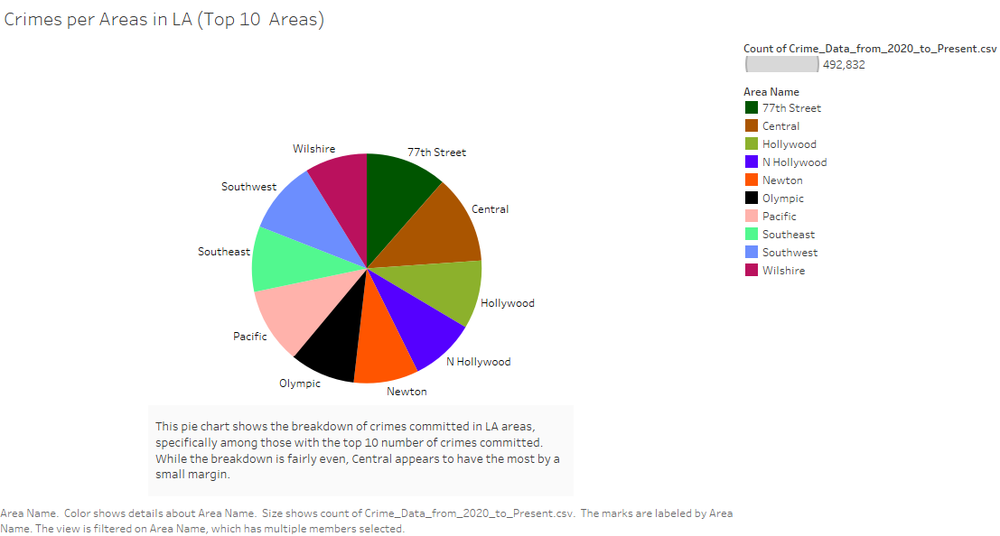
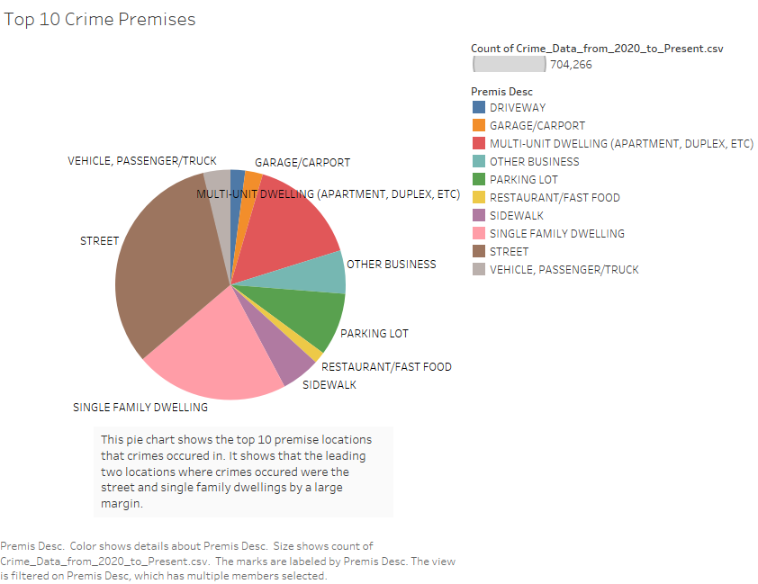
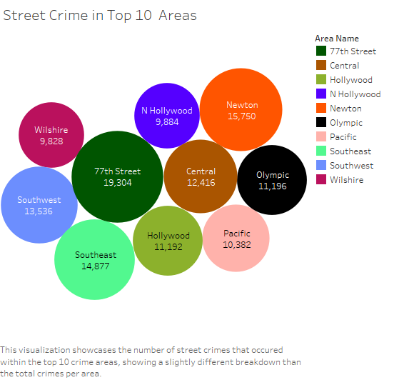
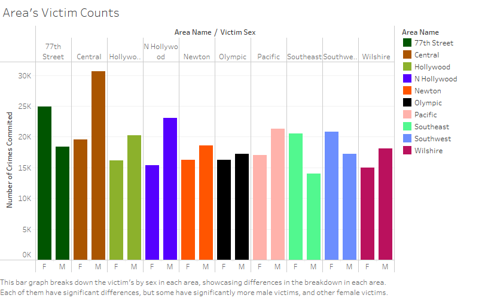
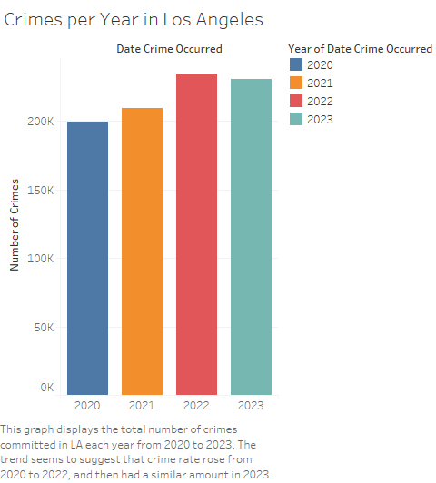
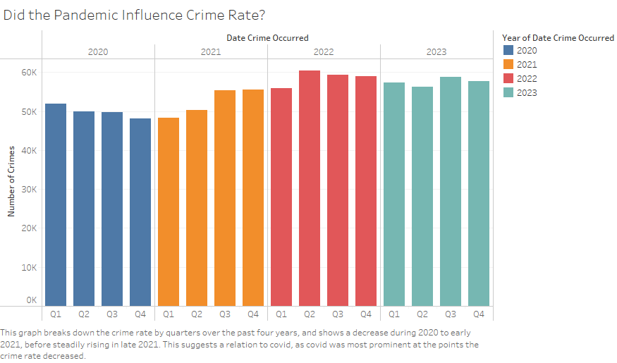
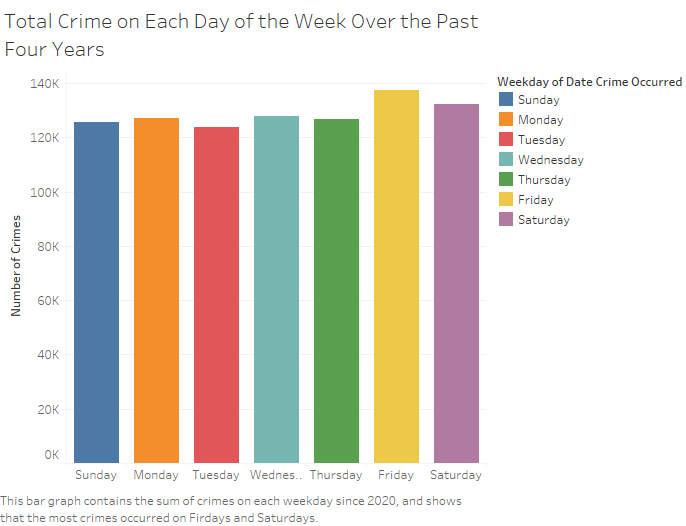
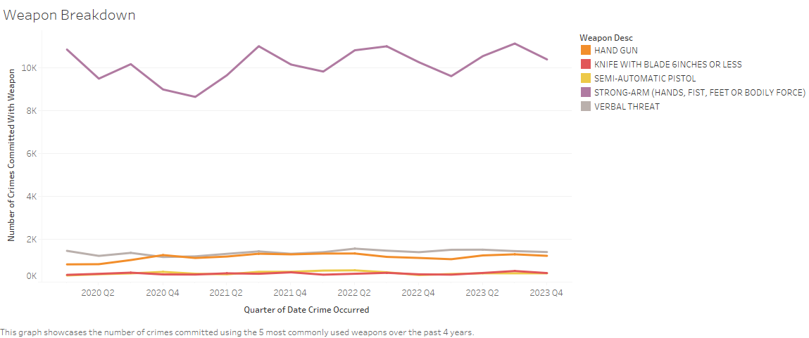
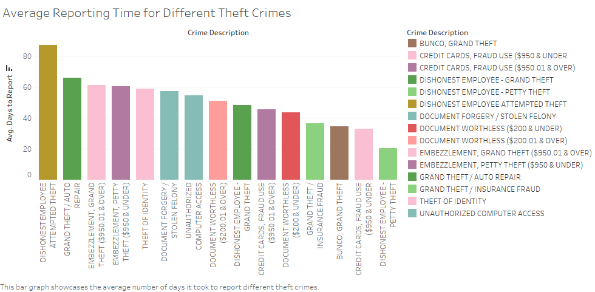

# Analysis of Los Angeles Crime Data
### By: Devon Gorel

## Introduction

The analysis  completed here dove into crime within Los Angeles in the past 4 years, seeking to find underlying trends. It uncovred a plethora of interesting things, namely that the COVID 19 Pandemic seemed to have an impact on the crime rate, along with the fact that different types of crimes occured in different proportions based on the area of Los Angeles. These discoveries, as well as others, are supported through graphs displayed on this website. Not all of the questions set out to be answered were easily discovered, yet many interesting takeaways were yeilded from the analysis.

## Dataset

The data set analyzed within this website contains data on crimes committed within Los Angeles from the year 2020 until now. 
It was collected by the Police Department of the City of Los Angeles, and contains thorough entries on each crime, including the date, type of crime, victim demographic, weapons used, and the location.
I was interested in the data because I thought it could provide a small yet thorough examination of crime over the past four years, and examine trends regarding it. For example, what crimes
occurred the most, if certain locations were more common for certain crimes, and if there was a trend on when crimes tended to occur. The data can be found here: https://catalog.data.gov/dataset/crime-data-from-2020-to-present

## Initial Questions

The draw of this data to me initially was that it was a rather robust dataset on crime encompassing many years, as well as many types of crimes, with data even down to the weapons and victims used. I was curious about many things going into this data, with some of the main questions I had being:
- Were certain areas of the city worse for crime?
- Was the crime rate constant over time?
- Did most crimes use weapons?
- Did the pandemic see a fall in physical based crimes? 

As I worked with the data, I came up with several more questions, partly because of the answers to my initial questions, and some due to difficulty handling the data. For example,
the crime categories were rather difficult to seperate into strictly physical and non physical crimes, so I ended up scrapping that question. Yet as I saw the trend in crime rate over time, I generalized the question on physical crimes to see if the pandemic seemed to affect crime rate at all. I also found that the data contained many null entries concerning weapon data, so I restructured my question to see which weapons were most common when used. Other questions I came up with included:
- Were the types of crimes proportionally distributed throughout parts of the city?
- How long did theft crimes typically take to be reported?
- Were victim demographics proportionate throughout the different areas?

The data was fairly easy to work with, as it was very well structured. The largest challenge I encountered was simply having to filter out empty or null data when examining certain fields, yet this was fairly simple. I was fairly surprised by the takeaways of some of the charts I constructed, such as the weapon chart and average reporting time chart.

## Discoveries & Insights
The first thing I examined was the breakdown of crime locations, and examined it through a pie chart showcasing the areas with the ten highest crime counts.

After looking at the graph, I saw that the crimes were fairly evenly dispersed. I didn't include every area due to space limitations, so as to make it easy to visualize, but every area had similar amounts overall.

The next thing I wanted to look at was the types of locations, or premises, upon which each crime occurred, such as a store or house. I generated a graph of the top ten premises at which crimes occured, producing the following pie chart.

This graph showed a clear result, that being that the majority of crimes occured on the street and in single family dwellings by a large margin. Knowing that these were the leading two premises at which crimes occurred, I wanted to further break down the areas crimes were committed in specifically at these two premises, producing the following graph.

Examining these 2 different plots shows somewhat surprising results at first. While the street crime is fairly similar to the original area pie chart in the proportions of crime each area takes up, the housing one is significantly different, especially with regards to Central. Central was the area with the most crime counts in the general crime plot, but has less than 1000 counts of crimes at single family dwellings. This led me to hypothesize that the Central area may be a primarily commercial district rather than residential, as that would explain why it had so many fewer residential crimes. At the same time, it would imply that since Central LA has the most crimes overall, it has a much higher proportion of crimes at business locations than the other districts, and those may make up the majority of the crimes.

While looking at areas, I was also curious about if there were common patterns among victims within the districts, and looked at the count of male and female victims in each district. The results were somewhat surprising to me.

I had expected that male and female victims would likely be similar in each area, or that at the least each district would have a similar patter. However, it ending up varying widely between districts, with each area having a significant difference in the amount of male and female victims, yet some had far more males, and others far more female victims.

The next big question I wanted to tackle was if crime had been rising or falling in recent years, and I wanted to explore trends within there. I generated a bar graph of the total crime rates from 2020 to 2023.

The graph showed me that there did seem to be an increase in crime from 2020 to 2022, before stabalizing relatively in 2023. Upon examining this, I noticed that the increase seemed to correlate with the timing in which we came out of the COVID-19 pandemic, and wondered if there was a correlation between the pandemic and crime rate. Thus, I generated a new bar graph where I expanded to look at the crime count for each quarter of the years.

The result of this graph spoke volumes. The COVID-19 pandemic hit America in early 2020, before practically shutting down the country starting in March 2020. The pandemic continued to have strong lockdown impacts, with cases peaking around January 2021. However, by early 2021 the vaccine was released, and restrictions started to be lifted on lockdown as more of society got vaccinated. Looking at this graph, we see that crime rate started falling progressively throughout 2020, and reached a bottom point around early 2021. It then began rising in Q2 of 2021, before significantly rising back to levels similar to those found in 2022 and 2023 in Q3 and Q4 of 2021. In otherwords, crime fell as the pandemic took hold, and then bounced back to higher amounts as soon as the lockdown went back. While the plummet was not huge, it is clear that the pandemic's social distancing had a watershed effect on decreasing crime.

Further digging into time, the graph below examines if certain days of the week had more crime, by totalling the crimes committed on weekdays over the past 4 years.

While the amounts remain mainly similar, Friday and Saturday seem to have slightly more crimes occur on those weekdays than the rest. Whether this is significant or by chance is unclear, but it could be correlated to the fact that people are far more likely to go out and do activities once the work week is done.

Another interesting part of the dataset was that it contained data on the weapons used in crimes. The following graph breaks down how weapon usage in crimes varied over the years, among the top 5 weapons used.

The visuals clearly show that most crimes did not use weapons, but rather physical force to carry out the crimes. This was fairly surprising to me, but I was also surprised by the fact that "Verbal Threat" was one of the top weapons. This graph also somewhat showed a dip in physical force in late 2020, which could support the theory that COVID-19 caused a decrease in physical crimes due to fear of the virus.

When looking through the crimes, I saw that there were many different categories of theft. Given that theft is not always immediately obvious, I was interested in the time that it took to report theft crimes. I calculated this by taking the difference between the report date and the date the crimes occurred, and plotted the types of thefts that took over 20 days on average to be reported.

Images should be large and easy to see and interperate. 
Captions underneath should be 20-70 words long.

## Conclusion

Final summary of the data and what you found during this project.

## Sources

Did any sources help you understand your data better? Make sure to cite them.
